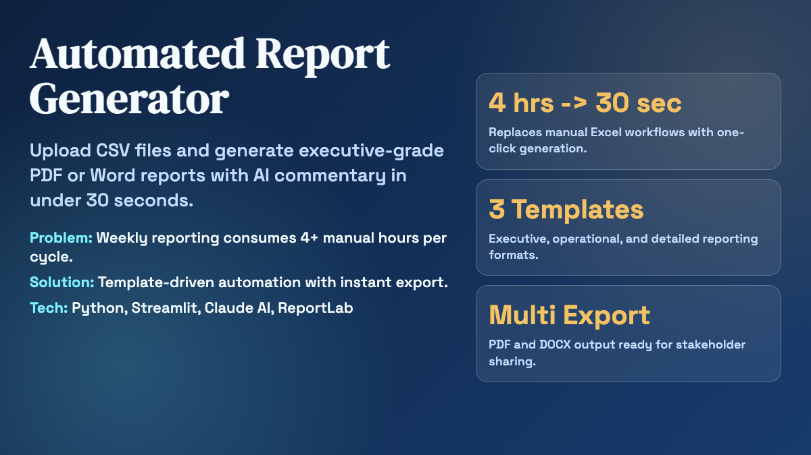
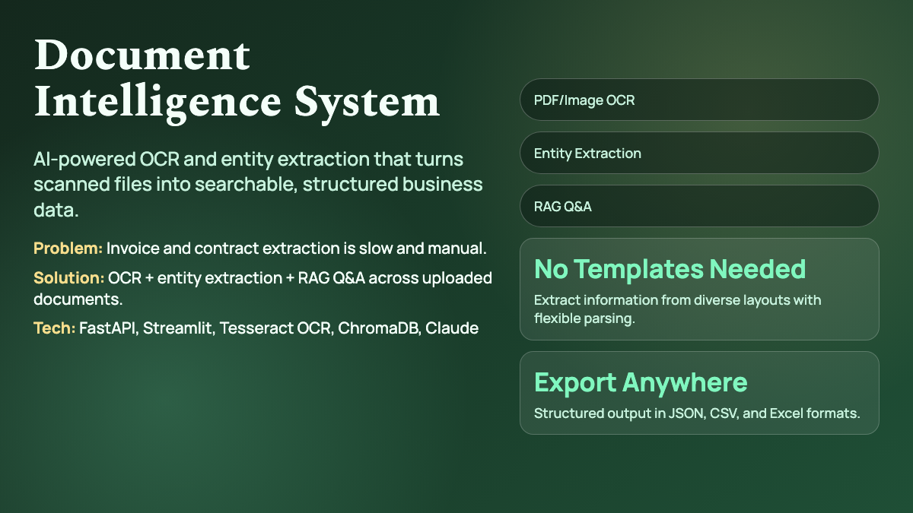
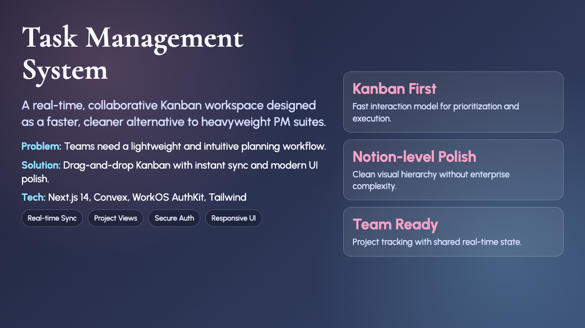

# Biswajit Mondal — Full-Stack Automation Engineer

> **Former Auditor (IIEST Shibpur 2016) → Full-Stack Developer**  
> I build AI-powered tools that save finance and operations teams 10-20 hours per week.

---

## 🚀 Featured Projects

### 1. Automated Report Generator
**Live Demo:** https://sciencenerd-des-upwork-por-automated-report-generatorapp-vuwedn.streamlit.app ✅

**The Problem:** Finance teams spend 4+ hours manually creating weekly reports in Excel

**My Solution:** Upload CSV → Get executive-ready PDF/Word reports with charts and AI insights in 30 seconds

**Tech Stack:** Python, Streamlit, OpenRouter API, Pandas, Matplotlib, ReportLab

**Key Features:**
- 📊 3 professional report templates (Sales, Financial, Inventory)
- 🤖 AI-powered executive insights (optional, with OpenRouter)
- 📈 Auto-generated charts with professional styling
- 📄 PDF and Word export with consistent branding
- ⏱️ Sub-30-second processing for 10,000+ rows
- 🔒 Zero data persistence (in-memory processing only)

---

### 2. Document Intelligence System  
**Live API:** https://document-intelligence-api.onrender.com *(Deploying...)*  
**Live UI:** https://document-intelligence-ui.streamlit.app *(Deploying...)*

**The Problem:** Manual data entry from invoices, contracts, and scanned documents costs hours per day

**My Solution:** AI-powered document processing with OCR, entity extraction, and RAG-based Q&A

**Tech Stack:** FastAPI, Streamlit, Tesseract OCR, ChromaDB, LangChain, Sentence Transformers

**Key Features:**
- 📄 PDF & image OCR with 95%+ accuracy
- 🔍 Automatic entity extraction (dates, amounts, names, GST, PAN)
- 💬 RAG-based Q&A chat with source citations
- 📝 AI-generated document summaries
- 📥 Export to JSON, CSV, or Excel
- 🚀 Template-free processing (works with any document)

---

### 3. Task Management System — Northstar PM
**Live Demo:** https://skill-deploy-x7ee1dkq31-codex-agent-deploys.vercel.app *(Demo Mode Active)*

**The Problem:** Existing project management tools are either too simple (Trello) or too complex (Jira)

**My Solution:** Notion-level polish with enterprise features, zero configuration overhead

**Tech Stack:** Next.js 14, TypeScript, Convex, WorkOS AuthKit, Tailwind CSS

**Key Features:**
- 📊 Portfolio dashboard with project health metrics
- 🎯 Kanban board with smooth drag-and-drop (dnd-kit)
- 📋 Task management with priorities and due dates
- 🔐 Secure authentication (WorkOS)
- 📱 Fully responsive (mobile, tablet, desktop)
- ⚡ Real-time sync across all devices
- 🎨 Custom design system with navy/indigo palette

---

## 🛠️ Skills & Expertise

**Python & Automation:**
- Pandas, NumPy, Matplotlib, Seaborn
- Streamlit for rapid data apps
- FastAPI for production APIs
- ReportLab, python-docx for document generation

**AI & Machine Learning:**
- LLM Integration (Claude, GPT-4 via OpenRouter)
- OCR with Tesseract
- Vector databases (ChromaDB)
- Embeddings & RAG pipelines

**Full-Stack Development:**
- Next.js 14 (App Router, TypeScript)
- React, Tailwind CSS, shadcn/ui
- Real-time databases (Convex)
- Authentication (WorkOS, JWT)
- REST API design

**Data & Finance:**
- Financial data analysis
- Excel automation with Python
- Business intelligence dashboards
- Audit & compliance workflows

---

## 💼 Professional Background

| | |
|---|---|
| **Current** | Auditor, Indian Audit and Accounts Department |
| **Education** | B.Tech, IIEST Shibpur (2016) |
| **Specialization** | Finance/operations automation, document processing, business intelligence |
| **Rate** | $50/hour |
| **Availability** | 20-30 hours/week |

---

## 📈 What Clients Get

✅ **Time Savings** — Tools that eliminate repetitive work  
✅ **Accuracy** — Automated processing reduces human error  
✅ **Insights** — AI-powered analysis of business data  
✅ **Professional Output** — Enterprise-grade deliverables  
✅ **Security** — No data persistence, privacy-first design

---

## 📞 Let's Talk

**Upwork:** https://www.upwork.com/freelancers/~01228b6c590d97c3cc  
**GitHub:** https://github.com/sciencenerd-des/upwork-portfolio  
**Email:** biswajit.mondal@email.com *(replace with your email)*

---

## 🎯 Ideal Projects

- Excel automation & report generation
- PDF/document processing pipelines  
- AI-powered business intelligence tools
- Full-stack web apps for operations teams
- Data cleaning, analysis, and visualization

---

*This portfolio is actively being deployed — live demo URLs will be updated within 24 hours.*
*Last updated: 2026-02-08*
