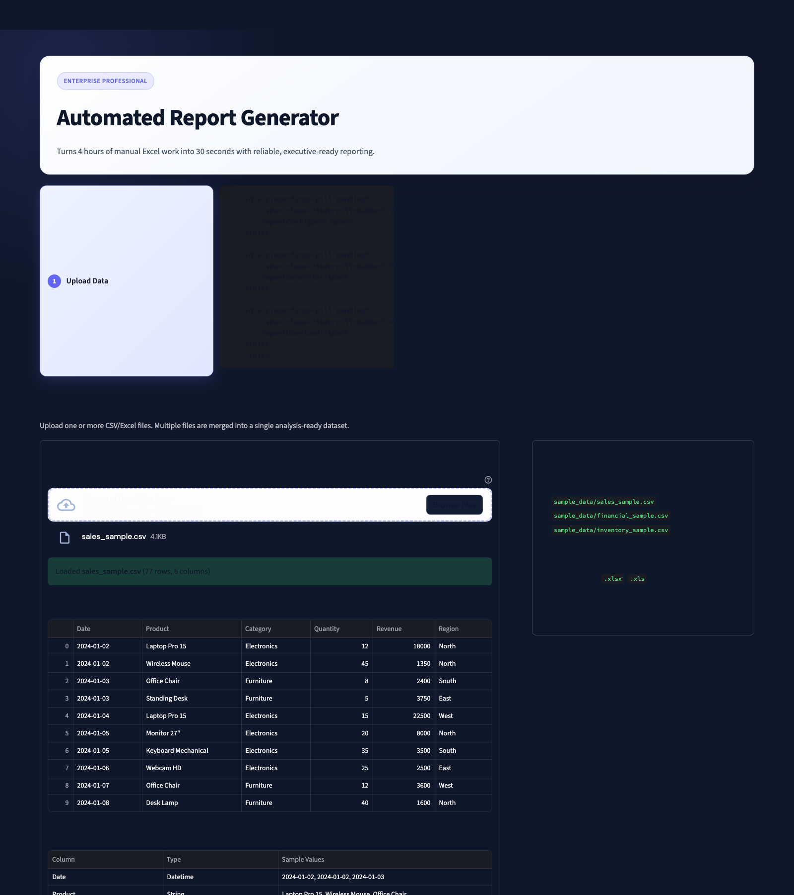
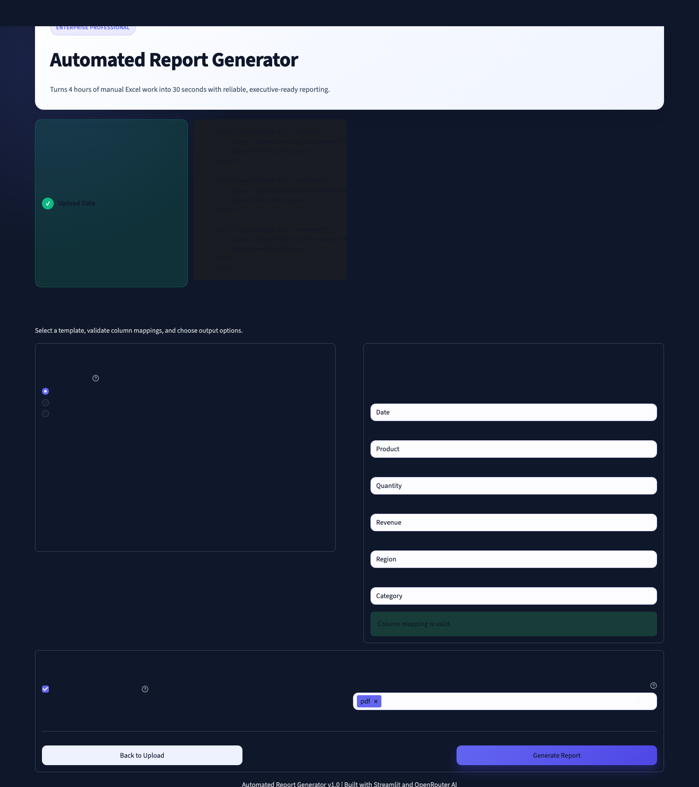
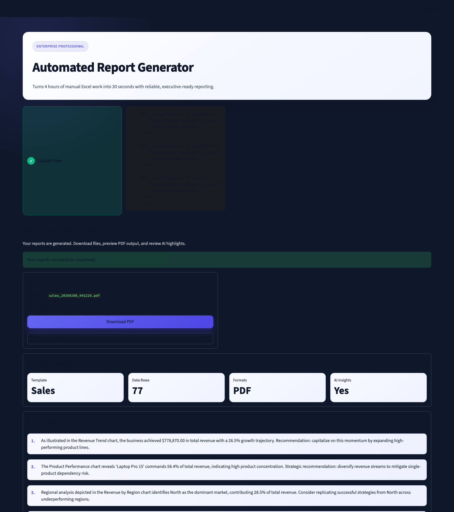
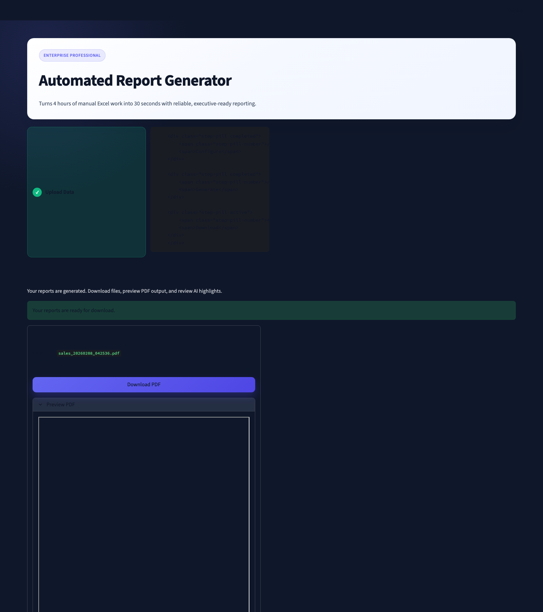
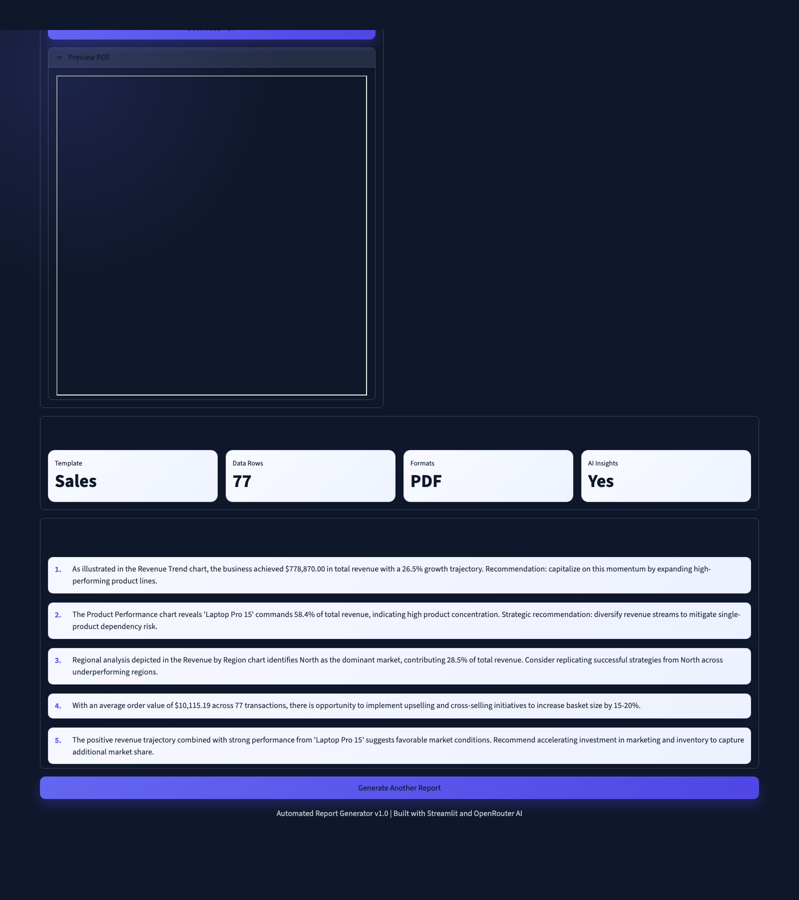

# Automated Report Generator

[](https://automated-report-generator.streamlit.app)

Transform raw CSV/Excel files into polished PDF and Word reports with charts, summaries, and optional AI commentary.

## Value Proposition

**Turns 4 hours of manual Excel work into 30 seconds.**
**Turns4hoursofmanualExcelworkinto30seconds**

Instead of manually cleaning data, building charts, formatting slides, and writing summaries, upload your file and generate executive-ready reports in one flow.

## Featured On

- Streamlit deployment for instant browser-based demos and client walkthroughs
- Upwork portfolio showcasing automation, reporting, and AI-assisted analysis

## Live Deployment

- App URL: `https://automated-report-generator.streamlit.app`
- Platform: Streamlit Cloud
- Demo intent: Upload sample CSV and generate PDF/DOCX in under a minute

## Screenshot Gallery

| Data Upload Step | Column Mapping |
|---|---|
|  |  |

| Report Generation | PDF Preview |
|---|---|
|  |  |

| AI Insights |
|---|
|  |

## What It Does

- Supports CSV and Excel uploads (`.csv`, `.xlsx`, `.xls`)
- Auto-detects and maps columns to template fields
- Generates line, bar, and pie charts with consistent styling
- Produces professional PDF and Word reports
- Adds optional AI insights through OpenRouter
- Handles multi-file uploads and combines into one dataset

## Crystal-Clear Setup

### 1. Prerequisites

- Python 3.9+
- `pip`

### 2. Install

```bash
git clone https://github.com/sciencenerd-des/upwork-portfolio.git
cd upwork-portfolio/automated-report-generator

python -m venv .venv
source .venv/bin/activate  # Windows (PowerShell): .venv\Scripts\Activate.ps1

pip install -r requirements.txt
```

### 3. (Optional) Enable AI Insights

```bash
export OPENROUTER_API_KEY=your_api_key_here
# Windows (PowerShell): $env:OPENROUTER_API_KEY="your_api_key_here"
```

Get a key from [OpenRouter](https://openrouter.ai/).

### 4. Run

```bash
streamlit run app.py
```

Open `http://localhost:8501`.

### 5. First Run Checklist

1. Upload `sample_data/sales_sample.csv`
2. Pick `Sales Report`
3. Keep auto-mapped columns
4. Click `Generate Report`
5. Download PDF and DOCX

## Usage Flow

1. Upload one or more files
2. Select report type (Sales, Financial, Inventory)
3. Review auto-mapped columns
4. Toggle AI insights/output formats
5. Generate and download reports

## Report Templates

### Sales Report
Required: `Date`, `Product`, `Revenue`

### Financial Report
Required: `Date`, `Category`, `Amount`, `Transaction Type`

### Inventory Report
Required: `Product`, `Quantity`, `Reorder Level`, `Unit Cost`

## Architecture Diagram (Text-Based)

```text
┌──────────────────────────────┐
│ Streamlit UI (app.py)        │
│ - Upload                     │
│ - Mapping                    │
│ - Options                    │
└──────────────┬───────────────┘
               │
               v
┌──────────────────────────────┐
│ Data Processor               │
│ src/data_processor.py        │
│ - load/merge/validate        │
│ - infer column types         │
└──────────────┬───────────────┘
               │
               ├─────────────┐
               v             v
┌─────────────────────┐   ┌─────────────────────┐
│ Chart Generator     │   │ AI Insights         │
│ src/chart_generator │   │ src/ai_insights.py  │
│ - line/bar/pie      │   │ - OpenRouter (opt.) │
└──────────┬──────────┘   └──────────┬──────────┘
           └──────────────┬──────────┘
                          v
               ┌──────────────────────────┐
               │ Report Builder           │
               │ src/report_builder.py    │
               │ - PDF (ReportLab)        │
               │ - DOCX (python-docx)     │
               └──────────┬───────────────┘
                          v
               ┌──────────────────────────┐
               │ Download Artifacts       │
               │ - *.pdf                  │
               │ - *.docx                 │
               └──────────────────────────┘
```

## Project Structure

```text
automated-report-generator/
├── app.py
├── requirements.txt
├── config/
│   ├── templates.yaml
│   └── styles.yaml
├── sample_data/
├── src/
│   ├── data_processor.py
│   ├── chart_generator.py
│   ├── ai_insights.py
│   └── report_builder.py
├── templates/
└── tests/
```

## Tests

```bash
python -m pytest tests/ -v
```

## Tech Stack

- Streamlit
- Pandas
- Matplotlib + Seaborn
- ReportLab
- python-docx
- OpenRouter API (optional)

## License

MIT
