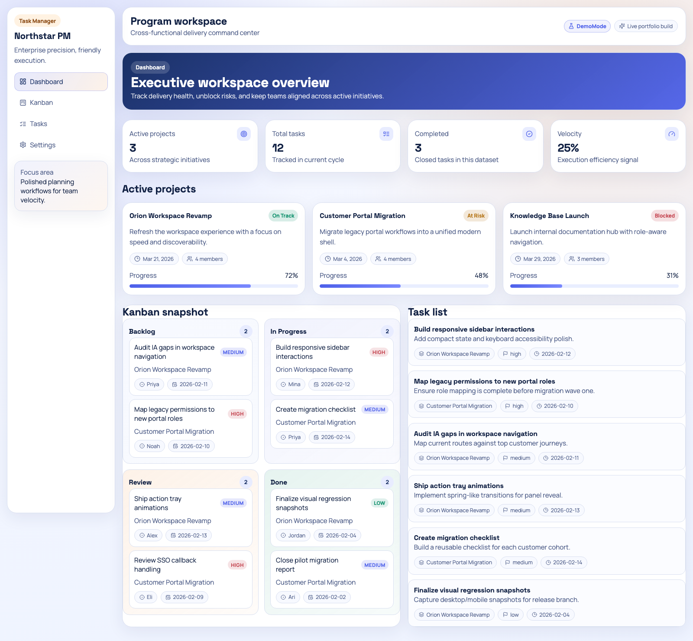
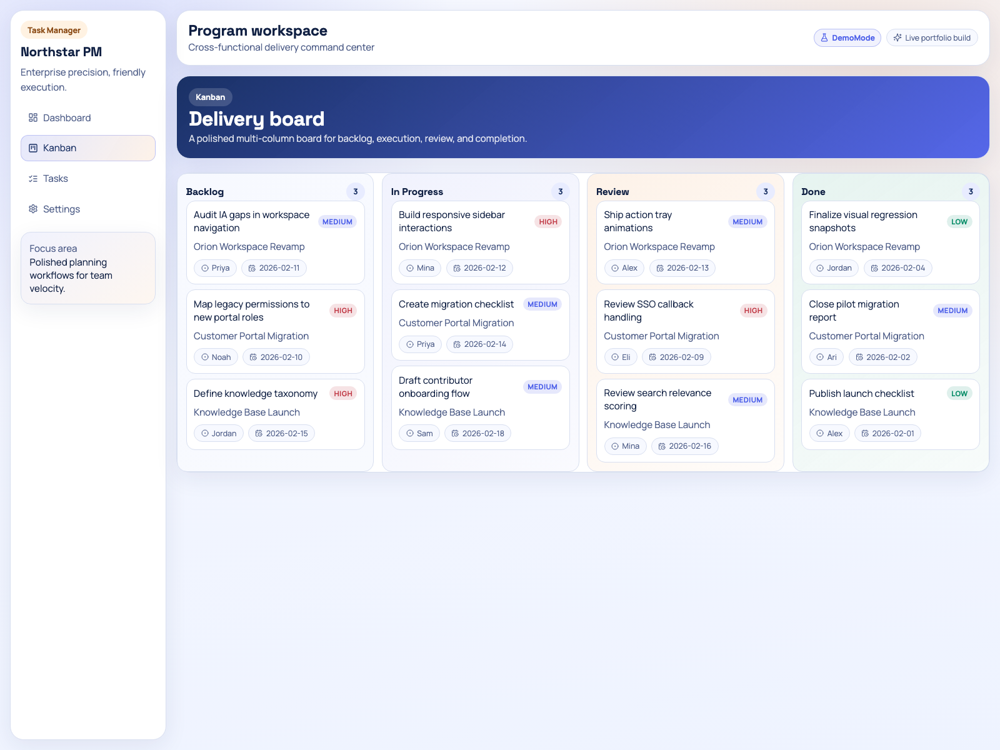
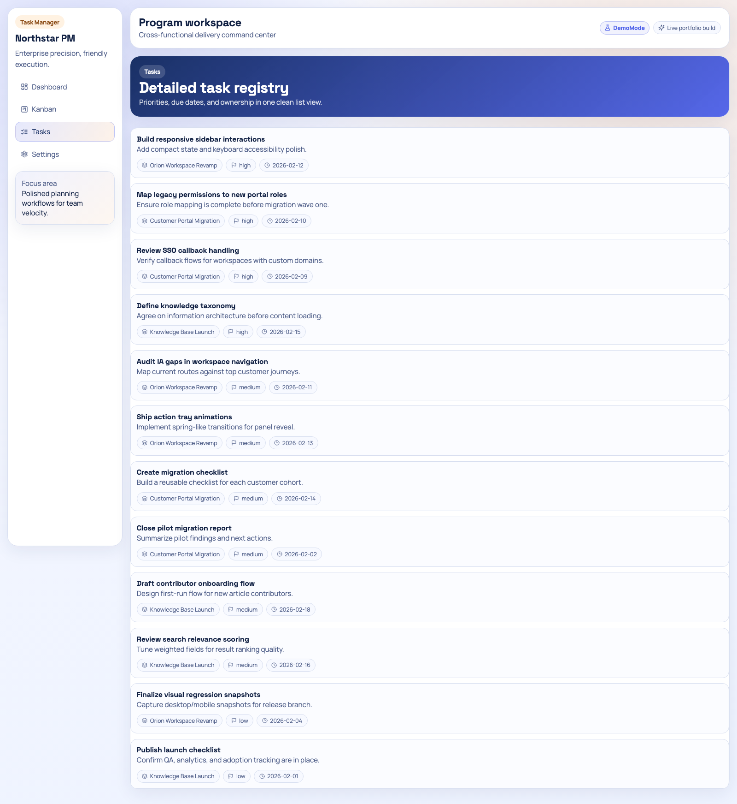
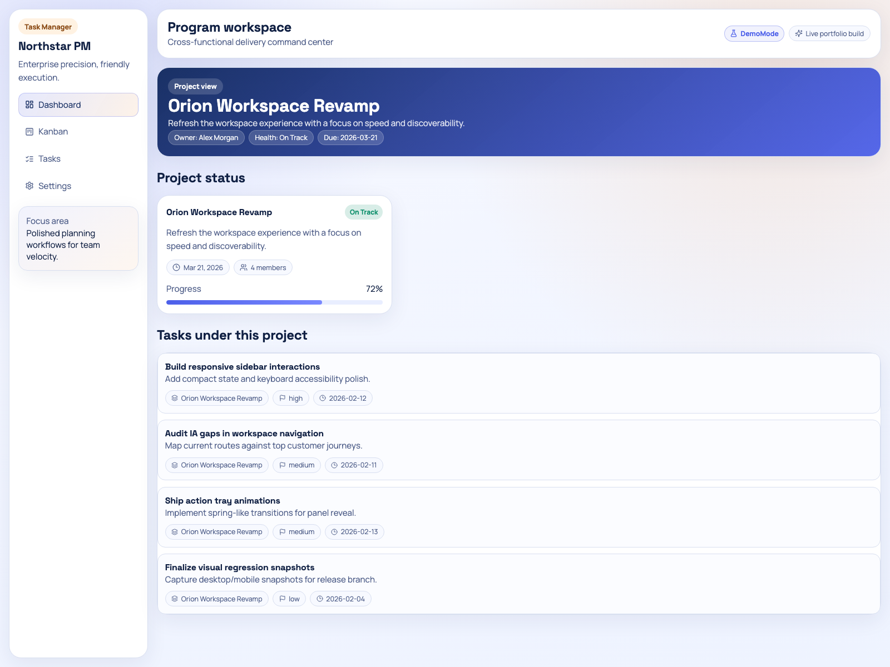

# Northstar PM

Enterprise-grade project management with Notion-level polish. Built for teams that need structure without friction.

**Live Demo:** https://skill-deploy-x7ee1dkq31-codex-agent-deploys.vercel.app

---

## Features

### Dashboard Overview
Portfolio-level project oversight with health signals, progress tracking, and team workload visibility.



### Kanban Board
Status-focused board with visual priority cues, smooth drag interactions, and clear ownership.



### Task Management
Comprehensive task views with filtering, priority sorting, and detailed progress tracking.



### Project Views
Deep-dive project analytics with timeline visualization, milestone tracking, and team assignments.



---

## Who This Is For

- **Product Teams** managing multiple workstreams with cross-functional stakeholders
- **Agencies** tracking client deliverables and internal resource allocation
- **Startups** needing enterprise-grade visibility without enterprise complexity
- **Remote Teams** requiring async-friendly status updates and clear ownership

---

## Getting Started

### Prerequisites
- Node.js 18+ 
- npm or yarn

### Installation

```bash
# Clone the repository
git clone <repo-url>
cd task-manager-frontend

# Install dependencies
npm install

# Set up environment
cp .env.example .env.local
```

### Environment Configuration

**For Demo Mode (Recommended for first run):**
```bash
NEXT_PUBLIC_DEMO_MODE=true
NEXT_PUBLIC_WORKOS_CLIENT_ID=demo_workos_client_id
WORKOS_CLIENT_ID=demo_workos_client_id
WORKOS_API_KEY=demo_workos_api_key
WORKOS_REDIRECT_URI=http://localhost:3000/auth/callback
```

**For Production (with WorkOS):**
```bash
NEXT_PUBLIC_DEMO_MODE=false
NEXT_PUBLIC_WORKOS_CLIENT_ID=your_client_id
WORKOS_CLIENT_ID=your_client_id
WORKOS_API_KEY=your_api_key
WORKOS_REDIRECT_URI=https://yourdomain.com/auth/callback
```

### Development

```bash
npm run dev
```

Open [http://localhost:3000](http://localhost:3000)

### Production Build

```bash
npm run build
npm run start
```

---

## Tech Stack

- **Framework:** Next.js 14 (App Router)
- **Backend:** Convex (real-time database)
- **Auth:** WorkOS (optional, demo mode available)
- **Styling:** CSS Variables + Custom Design System
- **UI:** Lucide Icons, custom components

---

## Project Structure

```
app/
├── page.tsx                 # Landing page
├── (auth)/                  # Auth routes (login, register)
├── (dashboard)/             # Protected dashboard routes
│   ├── dashboard/page.tsx   # Overview dashboard
│   ├── kanban/page.tsx      # Kanban board view
│   ├── tasks/page.tsx       # Task list view
│   └── project/[id]/        # Project detail pages
components/
├── layout/app-shell.tsx     # Dashboard shell
├── dashboard/               # Dashboard components
├── tasks/                   # Task management components
└── projects/                # Project components
convex/                      # Convex backend functions
├── projects.ts
├── tasks.ts
├── auth.ts
└── dashboard.ts
```

---

## Demo Mode

Demo mode enables the portfolio to run without full WorkOS auth wiring. Sample projects and tasks are pre-loaded with realistic data.

**To enable demo mode:**
1. Set `NEXT_PUBLIC_DEMO_MODE=true` in `.env.local`
2. Use placeholder WorkOS values (any non-empty string works)
3. The app displays a "Live Demo • Sample Data" indicator

---

## Deployment

### Vercel (Recommended)

[](https://vercel.com/new)

1. Import your repository
2. Add environment variables in Vercel dashboard
3. Deploy

### Custom Domain (Recommended for Production)

For a production deployment, consider using a custom domain:

1. **Vercel:** Add your domain in Project Settings → Domains
2. **Update WorkOS:** Add your custom domain to WorkOS Redirect URIs
3. **Environment:** Update `WORKOS_REDIRECT_URI` with your custom domain

Benefits of custom domain:
- Professional branding (e.g., `pm.yourcompany.com`)
- No dependency on preview/deployment URLs
- Better SEO and shareability

---

## Design System

- **Colors:** Navy foundation (`#132b60`), Indigo accents (`#4c5fe9`), warm details (`#f2a96b`)
- **Typography:** Manrope (body), Space Grotesk (headings)
- **Radius:** Large rounded cards (`22px`), medium components (`16px`)
- **Shadows:** Soft layered shadows for depth
- **Motion:** Subtle transitions (180-220ms), fade-in animations

---

## License

MIT - Built for portfolio demonstration.
